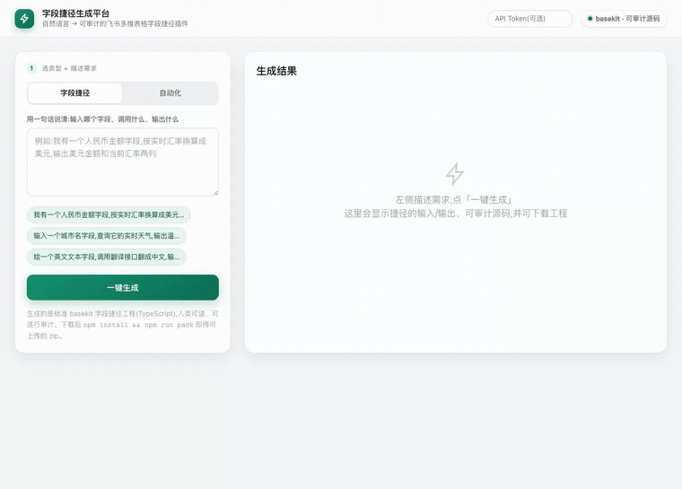
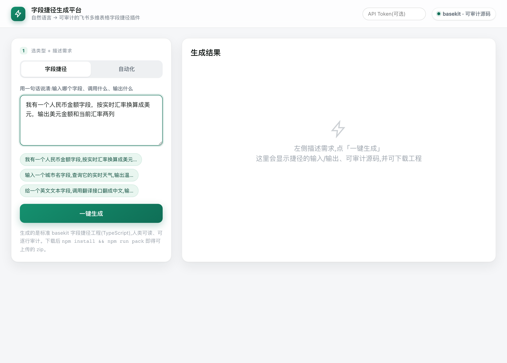
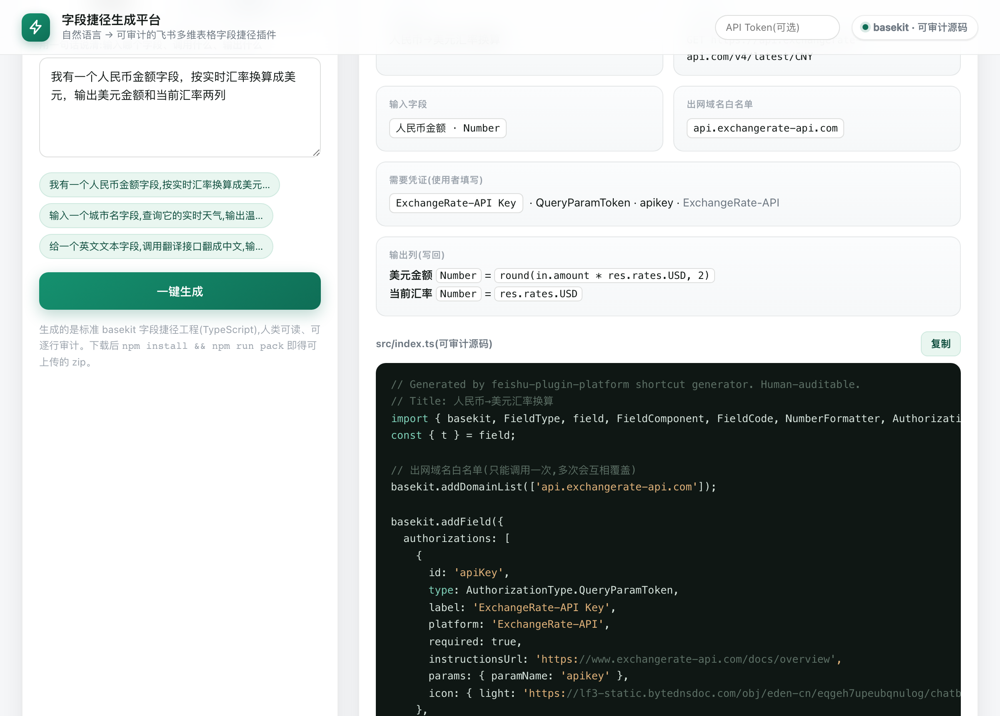
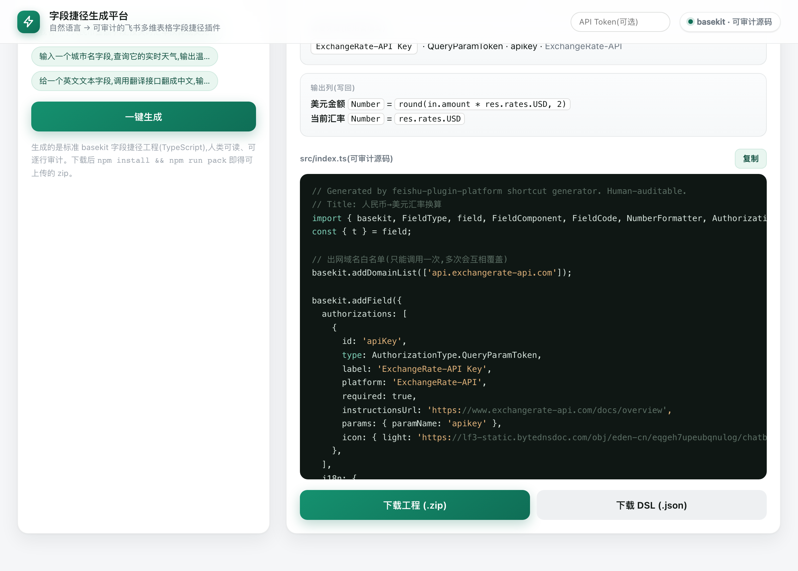
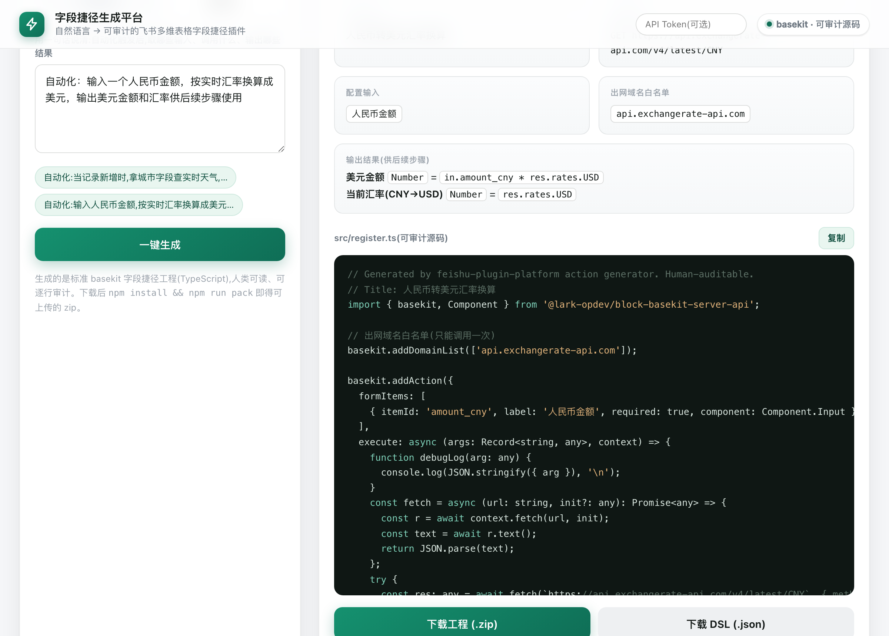

> 🌐 [中文](README.md) · **English**

# Feishu Bitable Plugin Generator · 飞书多维表格插件生成平台

> Describe what you want in one sentence → get a **real, line-by-line auditable** Feishu Bitable plugin (TypeScript) you can upload to Feishu.

[](https://go.dev) <!-- badge placeholder -->
[](#license) <!-- badge placeholder -->
[](#quick-start) <!-- badge placeholder -->
[](#what-it-generates) <!-- badge placeholder -->

A natural-language → basekit plugin generator for organizations using Feishu (**standard SaaS or privately-deployed — both supported**): they have Bitable and the plugin capability, but **no plugin marketplace and no in-house dev team**. You type one sentence; the platform emits a standard, human-readable basekit TypeScript project that goes through Feishu's normal upload + review chain.

It also ships the **delivery** side enterprises care about: a **self-hosted execute runtime** (connectors / field shortcuts call external APIs through your own server — no external function hosting) and **one-click release + deploy** (`scripts/release.sh`). See **[`OPERATIONS.md`](docs/OPERATIONS.en.md)**.

---

## 演示 · Live demo

A real, unedited screen recording — type one sentence, the model generates **and validates**, you get an auditable `src/index.ts` plus a one-click project download. The clip also shows switching to **自动化 (addAction)** and generating an automation action.



| ① 用一句话描述需求 | ② 生成结果概览（输入 / 出网白名单 / 鉴权 / 输出列） |
|---|---|
|  |  |
| **③ 可逐行审计的源码 + 一键下载工程** | **④ 切到「自动化」生成 addAction 动作** |
|  |  |

> 完整图文走查见 **[`docs/index.html`](docs/index.html)**（含上面的录屏与逐步截图，可作为发给客户的使用指南；用 GitHub Pages 指向 `/docs` 即可在线访问）。

---

## The problem it solves

A private Feishu deployment ships with the basekit plugin capability but, by design, **no public marketplace** — there is nowhere to "install" a community field shortcut or automation. Building one yourself means hiring someone who knows the basekit SDK. Most of these orgs (信创 / 政企 / state-owned enterprises) have neither.

This platform closes that gap. A non-engineer states a need in plain language; the platform produces a **real basekit project whose source a security/compliance team can read line by line before it is ever uploaded**. The generated TypeScript is the deliverable — not an opaque binary, not a hosted runtime you have to trust. For 信创 / 政企 customers, "audit it yourself, then submit it for review" is the selling point, not a caveat.

On **standard (public-cloud) Feishu** the runtime is Feishu's own basekit FaaS, so the generator's job is simply to emit a correct, standard, auditable project. **Privately-deployed Feishu has no FaaS** — so connector / field-shortcut execution runs on a **self-hosted execute runtime** you deploy (`cmd/execute-runner`: a DSL *interpreter*, not a code sandbox — no user JS, SSRF-guarded; see [`docs/EXECUTE_RUNTIME.md`](docs/EXECUTE_RUNTIME.en.md)). Either way the deliverable a security/compliance team reads is the **generated TypeScript**, not an opaque binary or a hosted runtime you have to trust.

---

## What it generates

Two generators, both targeting the official SDK `@lark-opdev/block-basekit-server-api` (pinned to `1.0.6`, CLI `1.0.5`):

### 1. Field shortcut · 字段捷径 (field shortcut) — `basekit.addField`

Pick input column(s) → call one external API → write back one or more output columns.

- **4 auth types** the end-user fills in at config time (never hardcoded): `HeaderBearerToken`, `QueryParamToken`, `CustomHeaderToken`, `Basic`
- `GET` / `POST` / `PUT` / `PATCH` / `DELETE` (read or write external systems), with flat or **nested JSON bodies** (`bodyJson`) and optional **custom request headers**
- **Multi-step chaining** (`steps`, ≤3): a later request can use an earlier one's response — `{stepId.json.path}` flows step output into the next step's URL/headers/body (e.g. fetch a token → call an API with it; geocode → weather)
- **Expression mapping** over two namespaces: `in.<inputKey>` (inputs) and `res.<dotted.json.path>` (response), plus `+ - * / % ( )`, array indices (`res.list.0.x`), `rand()`, string/number functions (`concat`/`upper`/`trim`/`substr`/`round`/`floor`/…), and **conditional logic in function form** — `eq`/`gt`/`and`/`if(cond,a,b)`/`coalesce` — so branching needs no raw `< > = ? :` operators
- Multi-property **Object result** (several derived columns at once) with optional `NumberFormatter`; column types `Text` / `Number` / `DateTime` / `Checkbox` / `SingleSelect` / `Phone` / `Email` / `Currency` / `Progress` / `Rating` / `Barcode` / `Url` (clickable link, rendered as a `{text,link}` cell value) / `MultiSelect` (a `string[]` — use `split(field, ',')`); the primary column is `Text`/`Number` per the SDK

**Example — NL → generated shortcut**

> "我有一个人民币金额字段，按实时汇率换算成美元，输出美元金额和当前汇率两列"
> *(I have an RMB-amount field; convert it to USD at the live rate and write back two columns: the USD amount and the current rate.)*

produces this DSL (the LLM's structured intermediate form)…

```json
{
  "id": "exchange-rate",
  "title": { "zh_CN": "汇率换算", "en_US": "Exchange Rate" },
  "domains": ["api.exchangerate-api.com"],
  "formItems": [
    { "key": "account", "label": { "zh_CN": "人民币金额" },
      "component": "FieldSelect", "supportType": ["Number"], "required": true }
  ],
  "result": {
    "kind": "object",
    "properties": [
      { "key": "id",   "type": "Text",   "groupByKey": true, "hidden": true, "expr": "rand()" },
      { "key": "usd",  "type": "Number", "label": { "zh_CN": "美元金额" },
        "primary": true, "formatter": "DIGITAL_ROUNDED_2", "expr": "in.account * res.rates.USD" },
      { "key": "rate", "type": "Number", "label": { "zh_CN": "汇率" },
        "formatter": "DIGITAL_ROUNDED_4", "expr": "res.rates.USD" }
    ]
  },
  "execute": { "url": "https://api.exchangerate-api.com/v4/latest/CNY", "method": "GET" }
}
```

…which compiles to an auditable `src/index.ts` calling `basekit.addDomainList([...])` + `basekit.addField({...})`, where `expr` is lowered to safe optional-chained JS (`in.account * res?.rates?.USD`).

### 2. Automation action · 自动化 (automation action) — `basekit.addAction`

Configure inputs → call one external API → return a result object that **downstream automation steps consume**.

- `APIKey` auth (runtime-injected), `GET`/`POST`/`PUT`/`PATCH`/`DELETE` + flat or nested (`bodyJson`) body + custom headers
- Same `expr` grammar (`in.<inputKey>`, `res.<json.path>`, arithmetic, functions, `if`/`eq`/`gt`… conditionals, `rand()`)
- Result is a plain object keyed by your output keys, with a typed `resultType`

**Example — NL → generated action**

> "自动化：当记录新增时，拿城市字段查实时天气，把温度和天气描述写进结果供后续步骤使用"
> *(Automation: on new record, take the city field, look up live weather, and return temperature + description for later steps.)*

produces an Action DSL (inputs / result / execute) that compiles to an auditable `src/register.ts` with `basekit.addAction({ formItems, execute, resultType })`.

---

## Architecture

```
                 NL prompt
                     │
   DeepSeek (default) │  forced function call — the function's JSON-schema
   or Claude (opt-in) │  parameters ARE the DSL schema (same source as the
                     ▼  validator), so the model can only emit structured DSL
            ┌──────────────────┐      validate → if invalid, feed the error
            │  Constrained DSL │◀── back as a tool result and retry (≤ 2 rounds)
            │  (JSON, the IR)  │
            └────────┬─────────┘
                     │  Go renderer (standard library only)
                     ▼
        ┌──────────────────────────────┐
        │ auditable basekit TS project │  src/index.ts | src/register.ts,
        │  + provenance header         │  package.json, tsconfig, test/, README
        └────────┬─────────────────────┘
                 │  testField / testAction → real outbound API call
                 ▼
          npm install → build → pack → upload to Feishu
```

- **DSL is an intermediate representation, not a runtime.** It exists only so the LLM has a structured, validatable target and the Go renderer has a stable input. `NL → DSL → TypeScript → testField → pack`.
- **NL → DSL** uses **DeepSeek** by default (OpenAI-compatible, **forced** function call; the tool's `parameters` schema is built from the same enums the validator checks, so schema and validator never drift). On invalid output the validation error is fed back as a tool result and the model retries — **auto-repair, ≤ 2 rounds**. **Claude** is opt-in (`LLM_PROVIDER=anthropic`). DeepSeek is a domestic endpoint, so its client **bypasses any proxy**.
- **Three compile-time guardrails** (this is what makes the output trustworthy):
  1. **Outbound-domain allowlist, statically pre-checked** — every `execute.url` host must be covered by `domains` (`addDomainList`). The SDK hard-rejects any fetch outside that list at runtime; we catch it at compile time first.
  2. **Expression allowlist — never `eval`, never arbitrary code.** `expr` is a tiny grammar (`number | 'string' | rand() | in.<key> | res.<path>` with `+ - * / % ( )` and an allowlisted set of pure-JS functions, including comparison/boolean/conditional helpers `eq`/`gt`/`and`/`if`/`coalesce`). Forbidden tokens (`; = [ ] { } $ \` " \\ // ?: & | ! < >`) are rejected outright — so even conditionals go through allowlisted functions, never raw operators. The expression is the *one* place a generator could otherwise smuggle JS, so it is allowlisted, not interpreted.
  3. **URL placeholder validation** — every `{placeholder}` in a URL or POST body must reference a declared input.
- **Storage is Feishu Bitable itself — zero external database.** The platform's own data (app/plugin definitions + per-user ownership) lives in a 多维表格, not Postgres/Redis. For a privately-deployed 信创/政企 product this is a feature, not a compromise: one fewer component to deploy, harden and back up; Feishu provides the durability (and the Base can be exported/snapshotted for retention); and admins can inspect/audit every stored definition in a familiar table UI — the platform dogfoods the very capability it sells. Reads go through a short-TTL cache with table-scoped queries (`GET /api/apps?tableId=`), so it holds up for the read-heavy reality (many viewers, few authors). **Scale envelope, stated honestly:** writes are low-frequency admin actions (publishing a plugin), bounded by the Feishu per-app QPS; cross-replica reads can be up to the cache TTL stale. A Postgres backend behind the same `store.Store` interface is an **optional** escape hatch for write-heavy / strict-DR deployments — isolated, drop-in, and *not* a prerequisite.

---

## Quick start

Prerequisites: **Go 1.24+**. For building the generated plugin: **Node.js + npm**. For NL generation: a `DEEPSEEK_API_KEY`.

### Run the tests

```bash
go test ./...
```

Covers the DSL validators (off-schema rejection), the expression allowlist, URL/domain pre-checks, and renderer output. The pinned basekit versions and `expr` lowering were verified end-to-end on a real basekit upload.

### SDK enum reconciliation — the trust gate

The generator emits references into basekit SDK enums (`FieldType.<KEY>`, `NumberFormatter.<KEY>`, `AuthorizationType.<KEY>`, `FieldComponent.<KEY>`, and an `addAction` auth literal). An off-list value compiles to `undefined` and breaks the published plugin at runtime with **no compile error** — that is how a phantom `PERCENT_ROUNDED_2` formatter once slipped in. To make that class of bug impossible to ship:

- `scripts/refresh-sdk-enums.sh` parses the SDK's `dist/index.d.ts` and writes the authoritative enum keys to `internal/shortcut/testdata/basekit_sdk_enums.json` (the golden).
- `internal/shortcut/sdk_reconcile_test.go` (runs under `go test ./...`) asserts **every** generator allowlist value is a subset of the matching SDK set, and prints the coverage gaps (SDK values not yet supported) for free.
- CI closes both directions: the test fails if an allowlist drifts from the golden; the `sdk-drift` job re-extracts from the pinned SDK and fails if the golden itself is stale (`.github/workflows/ci.yml`).

After bumping the SDK: `make sdk-enums`, review the diff, and the test will point at any allowlist that needs updating.

### CLI — `cmd/shortcutgen`

```bash
# JSON DSL → scaffolded basekit project (no LLM)
go run ./cmd/shortcutgen -out /tmp/exchange-rate \
  internal/shortcut/testdata/exchange_rate.json

# Natural language → field shortcut (needs DEEPSEEK_API_KEY)
DEEPSEEK_API_KEY=sk-... go run ./cmd/shortcutgen \
  -nl "把人民币金额按实时汇率换算成美元，输出美元金额和汇率" \
  -out /tmp/exchange-rate -dump

# Natural language → automation action
DEEPSEEK_API_KEY=sk-... go run ./cmd/shortcutgen -action \
  -nl "拿城市字段查实时天气，返回温度和天气描述供后续步骤使用" \
  -out /tmp/weather-action
```

Flags: `-out` (required) scaffold dir · `-nl` natural-language request · `-action` treat input as an automation Action · `-dump` also print the generated DSL JSON to stderr.

### Web platform

Two services: a **BFF gateway** (`cmd/api`) and the **NL→DSL generator** (`cmd/generator`, holds the LLM key).

```bash
# Terminal A — generator (holds the LLM key)
DEEPSEEK_API_KEY=sk-... PORT=8090 go run ./cmd/generator

# Terminal B — BFF + static web platform
PORT=8080 GENERATOR_URL=http://localhost:8090 WEB_DIR=./web go run ./cmd/api
```

Open <http://localhost:8080/shortcut.html> — toggle between **字段捷径 / 自动化**, type a request, click 一键生成, review the **auditable source**, and download the project `.zip` (or just the DSL `.json`).

### User login & per-user ownership (optional)

Each person can sign in **with their own Feishu identity** so the plugins they create are **attributed to and owned by them** (a creator line is rendered into the source + `dsl.json`, and each user sees only their own plugins under "我的插件"). Enable it by configuring Feishu OAuth on the platform:

```bash
FEISHU_APP_ID=cli_xxx FEISHU_APP_SECRET=xxx \
  FEISHU_BASE_DOMAIN=feishu.cn \
  OAUTH_REDIRECT_URI=https://your-host/auth/callback \
  SESSION_SECRET="$(openssl rand -hex 32)" \
  PORT=8080 GENERATOR_URL=http://localhost:8090 WEB_DIR=./web go run ./cmd/api
```

Register `OAUTH_REDIRECT_URI` in the Feishu app's redirect-URL allowlist. When unset, login is disabled and the platform stays anonymous (unchanged). Routes: `GET /auth/login`, `GET /auth/callback`, `POST /auth/logout`, `GET /api/me`, and the cookie-authed `GET/POST /api/my/plugins` + `DELETE /api/my/plugins/{id}`. Identity uses a stateless HMAC-signed session cookie.

**Ownership persistence**: by default the per-user plugin store is in-process (lost on restart). To **persist ownership across restarts**, point it at a Feishu Bitable table — add `FEISHU_BITABLE_APP_TOKEN` (the platform's Base) + `FEISHU_PLUGINS_TABLE_ID` (a table with text fields `id`, `owner_open_id`, `owner_name`, `title`, `kind`, `dsl`, `created_at`). Each plugin is one record; users only ever see their own (owner-scoped reads).

To use Claude instead of DeepSeek:

```bash
LLM_PROVIDER=anthropic ANTHROPIC_API_KEY=sk-ant-... MODEL=claude-opus-4-8 \
  PORT=8090 go run ./cmd/generator
```

### Build & upload the generated project

Inside any scaffolded / downloaded project:

```bash
npm install
npm run build    # type-check against the real basekit SDK types
npm run pack     # block-basekit-cli pack:field → output/*.zip
```

Then upload the zip in your Feishu developer console (field-shortcut capability) and have an admin approve it. (Automation actions are verified via `testAction` and uploaded with `block-basekit-cli upload`; the CLI has no `pack:action`.)

---

## Security model

The generated source is meant to survive a hostile read by a compliance team.

- **No `eval`, no arbitrary code.** Values come from an allowlisted expression grammar, lowered to safe JS with optional chaining for the (untrusted) response. There is no path for the LLM, the DSL, or a malicious prompt to inject executable code into the rendered `execute()`.
- **Outbound-domain allowlist.** Every external host is declared in `domains` and emitted as a single `addDomainList([...])`; the URL host is statically checked against it before any TypeScript is rendered. The basekit runtime enforces the same list — there is no second, hidden way out to the network.
- **Credentials are never hardcoded.** API keys/tokens are declared as `auth` that the **end-user** enters at config time and the Feishu runtime injects; they never appear in the generated URL or source.
- **Auditable + provenance.** Every file carries a "Generated by feishu-plugin-platform … Human-auditable." header. The output is plain, readable TypeScript — diff it, read it, then submit it for review.

---

## Repository layout

```
.
├── cmd/
│   ├── api/             BFF / gateway: app CRUD, NL-generation proxy, /api/execute forward, auth
│   ├── generator/       NL → DSL service (holds the LLM key); /shortcut/* and /action/* endpoints
│   ├── execute-runner/  self-hosted execute runtime — the FaaS replacement for private deployments
│   ├── shortcutgen/     CLI: -nl (NL) / -action (automation) / -out (scaffold)
│   └── bitable-bootstrap/  one-shot helper to create the backing Bitable via app credentials
├── internal/
│   ├── shortcut/        field-shortcut + action DSL: validation, expr allowlist, render, scaffold, zip
│   ├── execrt/          DSL interpreter behind execute-runner (no user JS; SSRF-guarded)
│   ├── generator/       LLM integration: DeepSeek (default) + Claude (opt-in), forced tool call + auto-repair
│   ├── dsl/             AppDefinition DSL for the container renderer
│   ├── store/           definitions + per-user plugins (Bitable-backed, read-cached, table-scoped)
│   ├── auth/            Feishu OAuth + signed session
│   └── api/ · httpx/    BFF handlers + HTTP server helpers
├── plugin/block/        the in-Bitable container widget (opdev) — renders an AppDefinition / enrich DSL live
├── plugin-center/       catalog of example generated plugins (one directory each)
├── web/                 shortcut.html (NL authoring UI) + index.html (mock renderer; dev only)
├── publisher/           opdev / console publishing automation (RPA)
├── deploy/              docker compose (prod) + k8s manifests + Caddy
├── scripts/             release / deploy / publish-plugin / manage-plugins / refresh-sdk-enums
└── docs/                index.html (landing) + PRODUCTION · OPERATIONS · EXECUTE_RUNTIME · ROADMAP · design
```

> **Two current tracks, both live:** (1) the **generator** — NL → auditable basekit project (`internal/shortcut` + `cmd/shortcutgen` + `web/shortcut.html`), uploaded through Feishu's normal review chain; and (2) the **container renderer** — `plugin/block` (opdev SDK) renders an `AppDefinition`/`enrich` DSL pulled from the platform API *directly inside a Bitable*, so a small-team author publishes a **definition** (data), not a freshly-reviewed plugin each time. `internal/dsl` + `internal/store` + the container are this track. An earlier standalone `@lark-base-open/js-sdk` renderer (`frontend/`) was superseded by `plugin/block` and removed; `web/index.html` remains only as the dev mock renderer.

---

## Status & what's verified

- ✅ `go test ./...` green: DSL validators, expression allowlist, URL/domain guardrails, renderer output.
- ✅ Generated projects type-check against the **real** basekit SDK types (`block-basekit-server-api 1.0.6`).
- ✅ `testField` / `testAction` make **real** outbound calls (exchange-rate, weather, httpbin) and write back correctly.
- ✅ Verified in a browser end-to-end via the web platform.
- ✅ **Full loop proven:** a generated automation action was uploaded (`block-basekit-cli upload`), published, and then **installed, configured, and enabled inside a real Feishu Base automation**.

---

## Roadmap

- **Field shortcuts:** more `FieldComponent` types and result kinds beyond the single Object result; broader `NumberFormatter` coverage.
- **Automation actions:** auth beyond `APIKey` (the action authorization shape differs from fields and is under-documented — deferred for a verified follow-up).
- **Expression grammar:** carefully widen atoms/operators while keeping the strict allowlist invariant.
- **Platform:** persistence of generated definitions; one-click path from generate → review → upload.

(See `docs/ROADMAP.en.md` for the broader capability survey of the Feishu plugin ecosystem — note it largely maps the earlier container/DSL view-extension direction.)

---

## License

MIT.
