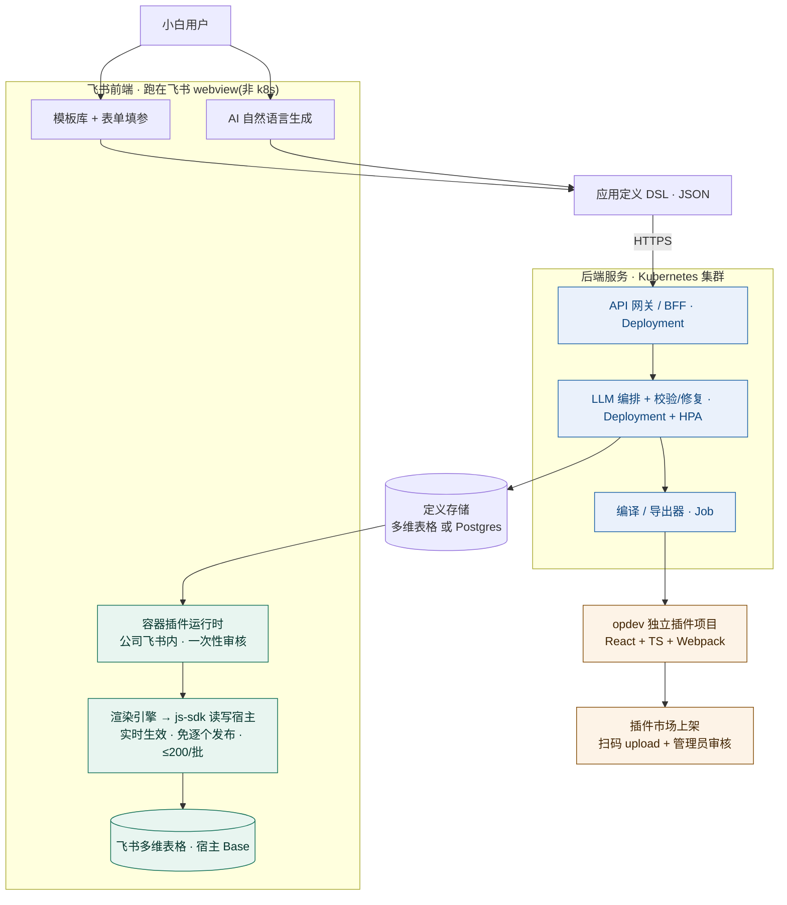
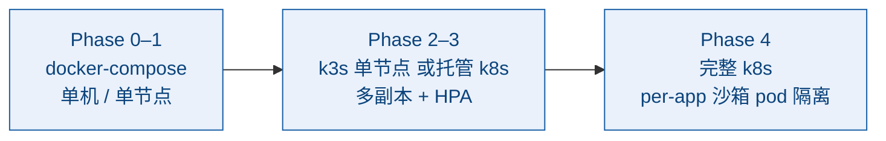

> 🌐 [中文](design.md) · **English**

# Feishu Bitable Plugin Generation Platform · Technical Design

> ⚠️ **Parts of this document are superseded (an early design draft finalized 2026-06-20)**. It is kept for design background, but where it conflicts with the current system, **the code and current docs win**: `README.md`, `docs/PRODUCTION.md`, `docs/EXECUTE_RUNTIME.md`. Known major deviations (fixed inline below): **the renderer actually uses `@lark-opdev/block-bitable-api` (NOT `@lark-base-open/js-sdk`)**; **the primary shipped output is basekit field shortcuts (addField) + automation actions (addAction), and the container/view-extension is a read-only render host, not the only product**; **the live deployment is docker compose + Caddy auto-TLS on EC2 (k8s = optional future scale-out path)**; **the LLM default is DeepSeek (can switch to Claude)**; auth is **capability-split** (read-only client token / server-only admin token), and both an **audit ledger** and an **egress ledger** have shipped.

> **One-line positioning**: A platform that lets non-technical users "generate with one click, deploy with one click" Feishu Bitable plugins.
>
> **Settled architecture decisions**: Hybrid architecture (container-first + exportable) · Internal enterprise use (single-tenant) · Template forms + AI natural language dual generation · Backend services deployed on Kubernetes (the Feishu frontend container plugin is not inside k8s).
>
> **Finalized**: 2026-06-20 · Content is based on prior multi-source research and adversarial verification (23 confirmed / 2 rejected).

---

## 1. Core Insight: Why "Container Mode" Makes One-Click Possible

Feishu has two hard walls that kill "one-click deployment":

1. Publishing a self-built plugin requires **enterprise admin review**;
2. `opdev login` requires **QR-code authorization**.

If every plugin a non-technical user generates is treated as a "new plugin" to be published, one-click can never be achieved.

> 💡 **Breakthrough**: The platform itself is built as **one** already-reviewed "container plugin". What a non-technical user generates is not a new plugin, but an **application definition (data)**. The container fetches the definition and renders the UI in real time with a built-in engine → ready to use upon generation, with **zero per-item review**. Review happens only **once**, when the "container plugin" is first listed. This is the root that makes the entire architecture viable.

---

## 2. Overall Architecture



- **Feishu frontend (green)**: Container plugin + rendering engine, running in the Feishu webview, **not on k8s** (Feishu hosting constraint).
- **Backend k8s (blue)**: API / LLM orchestration / compile & export are containerized and orchestrated/scheduled by k8s.
- **Export path (orange)**: Standalone plugin, requires QR-code scan + admin review.

---

## 3. Generation Layer (Template + AI Dual Track)

| Track A — Template Library + Form (workhorse) | Track B — AI Natural Language (highlight) |
|---|---|
| Covers about 80% of needs, **zero hallucination**. High-frequency scenarios are built as parameterized templates; non-technical users only fill in a form (which table, which fields, what parameters). | Covers the long tail and serves as the experience highlight. The user describes a need in one sentence → the LLM **first tries to match a template and fill its parameters**, locking hallucination down to the parameter layer; only when no match is found does it generate a constrained DSL or sandboxed code snippet. |
| Scenarios: data dashboards / stat cards, charts (bar/line/pie), Gantt charts, import/export, find & replace, dedup, reminders & notifications, AI field processing (batch summarization / classification / translation). | Key constraint: AI **does not output arbitrary React code**, only schema-constrained DSL → verifiable, sandboxable, auto-repairable. |

---

## 4. Application Definition DSL (the Platform's "Hard Currency")

A single declarative JSON drives both "container rendering" and "export compilation" — this is the key that lets the architecture satisfy both paths at once:

```json
{
  "id": "app_sales_board",
  "name": "销售看板",
  "type": "view_extension",
  "bind": { "baseId": "current", "tableId": "tbl_orders" },
  "ui": {
    "layout": "dashboard",
    "components": [
      { "type": "stat",  "title": "本月销售额", "agg": "sum", "field": "金额", "filter": "month(下单时间)=THIS_MONTH" },
      { "type": "chart", "chartType": "bar", "x": "销售员", "y": { "agg": "sum", "field": "金额" } }
    ]
  },
  "actions": [
    { "id": "export", "trigger": "button", "label": "导出 Excel", "do": "exportXlsx", "scope": "currentView" }
  ]
}
```

---

## 5. Container Plugin + Runtime Engine (the Vehicle for "One-Click Use")

> 📌 **Current-state correction**: the actual **primary output** is basekit **field shortcuts (addField) + automation actions (addAction)**; the container / view extension here is a **read-only render host**, not the only product. It does **not** generate Feishu sidebar plugins or 数据连接器 (data connectors).

- A standard Feishu **data-table view plugin** (React + TS + Webpack, the official stack), **published once** within the company's Feishu.
- A built-in **universal rendering engine**: reads the DSL → renders the UI with a pre-built component library; data access uniformly goes through `@lark-opdev/block-bitable-api` (running in the host context, **automatically inheriting the user's permissions on the current Base, no extra authorization needed**; batch writes ≤ 200 per call).
- Logic is split into two tiers: **declarative actions** (filter / aggregate / export / notify…) cover the vast majority; the long tail uses a **sandbox** (QuickJS or Web Worker + capability allowlist) to run AI-generated code snippets, preventing privilege escalation.

> ⚠️ **Design discipline**: The engine must be "definition-driven" rather than "code-driven" — new capabilities should as far as possible come from extending the DSL/components, not from changing the container code. This keeps "container re-release review" to the lowest possible frequency.

---

## 6. Backend Services (Internal Enterprise Use, Can Be Minimal)

- **Definition storage**: Direct dogfooding is recommended — use **one Bitable table** to store all application definitions (owner, bound table, definition JSON, version). It naturally comes with Feishu-native permissions/sharing, saving a separate database and admin backend.
- **LLM orchestration**: Planning → template matching → parameter filling → schema validation → **auto-repair loop** (on validation failure, feed back to the LLM to retry) → preview. The API key stays on the backend and is not exposed to the frontend.
- **Compiler/exporter**: DSL → inject into the `opdev create` scaffold → package as a zip.

> 📌 **Current-state correction (auth + audit shipped)**: auth is **capability-split** — the client bundle embeds only a read-only token (reads `/api/apps*` + `POST /api/execute`), while write/delete/generate go through a server-only admin token, so a leaked client token can only read. An **audit ledger** (`GET /api/audit`, admin-only, append-only dedicated table) and an **egress ledger** (every outbound call records `execute.egress`; SSRF/redirect blocks recorded as errors; graceful drain) have shipped. See `docs/PRODUCTION.md` / `docs/EXECUTE_RUNTIME.md`.

### 6.1 Kubernetes Deployment (Backend Services on k8s)

> Note: **Only the backend services run on k8s**; the Feishu container plugin is frontend, runs in the Feishu webview, and is not inside k8s (see the architecture diagram in Section 2).

| Service | k8s Workload | Notes |
|---|---|---|
| API gateway / BFF | `Deployment` + `Service` + `Ingress` | Unified entry for the container plugin and the generation-side UI; TLS terminates at the Ingress. |
| LLM orchestration service | `Deployment` + `HPA` | Stateless, bursty load; auto-scales by QPS / concurrency. |
| Compiler / exporter | `Job` (on demand) | DSL → opdev project packaging is a one-off build task; use a Job to spin up a build pod, reclaimed on completion. |
| Definition storage | External (Bitable) or `StatefulSet` (Postgres) | With Bitable it lives outside the cluster; move to Postgres if strong consistency / complex queries are needed. |

- **Config and secrets**: LLM API key and the Feishu self-built app's `app_id/app_secret` use `Secret`; model selection and rate-limit parameters use `ConfigMap`.
- **Environment isolation**: split `namespace` into dev / prod; images go through CI build + private registry.
- **Observability**: unified logs / metrics; LLM call billing and failure rate get separate metrics (balance exhaustion must be detected immediately, not misdiagnosed as some other fault).

> ⚠️ **Right-sizing reminder**: For internal, single-tenant enterprise scale, full k8s may be too heavy. If concurrency is low, single-node `k3s` / `docker-compose` is enough; the real payoff of moving to full k8s is the **later per-app sandbox pod isolation (Phase 4)** and multi-replica elasticity. Recommendation: first get backend containerization + k8s orchestration solid, and sandbox isolation in Phase 4 lands naturally on the same cluster.

---

## 7. Deployment Story (an Honest Breakdown of the "One-Click Deploy" Boundaries)

| Path | Truly one-click? | Notes |
|---|---|---|
| **Container path (default)** | ✅ Truly one-click | The user clicks "Publish" = the backend stores one definition record, the container renders instantly. Zero review, instant effect. |
| The container plugin itself | One-off | First listing needs one admin review; occasional re-release when the platform upgrades the container (low frequency). |
| **Export path (advanced)** | ⚠️ Semi-automatic | Constrained by `opdev login` QR-code scan + admin review; the platform delivers "one-click generate project + one-click build + guided publishing", with the final step manual. |

---

## 8. Phased MVP Roadmap

| Phase | Deliverable | Notes |
|---|---|---|
| **Phase 0** Foundation (1–2 weeks) | Container plugin skeleton + rendering engine (1–2 component types) + definition storage (using Bitable) | Publish once in the company's Feishu, get the "store definition → container render" loop working. |
| **Phase 1** Template track | 5–8 high-frequency templates + form generator + live preview | **Usable by non-technical users at this point.** |
| **Phase 2** AI track | Natural language → template parameter filling + schema validation / auto-repair | The experience highlight, built on the DSL foundation. |
| **Phase 3** Export | DSL → opdev project zip + publishing guide | Semi-automatic, addresses the "real plugin" demand. |
| **Phase 4** Long tail | Sandboxed execution of AI code snippets | Covers scenarios templates can't. |

### 8.1 Deployment Evolution: compose First, k8s Later

The backend architecture is designed for k8s, but **you don't have to go full k8s from the start**. Migrate progressively by phase and concurrency pressure:



| Phase | Deployment form | Migration trigger signal |
|---|---|---|
| Phase 0–1 | `docker-compose` (the few backend services started together) / single node | Value-validation period, low concurrency, the simpler the ops the better. |
| Phase 2–3 | `k3s` single node or managed k8s; LLM orchestration on multiple replicas + HPA | Users / concurrency grow, requiring elasticity, rolling releases, and standardized Secrets. |
| Phase 4 | Full k8s; one sandbox `pod` per app / per tenant (resource quota + network policy) | Launching the AI code sandbox, requiring strong isolation against privilege escalation + resource limits. |

> 🏁 **Key**: Write images and manifests to be "k8s-orchestratable" from Phase 0 (12-factor, stateless, config via environment variables / `Secret`), so that compose → k8s is a smooth switch, not a rewrite.

---

## 9. Tech Stack Choices (Aligned with Existing Capabilities)

- Container/frontend: React + TS + Webpack + `@lark-opdev/block-bitable-api`.
- Backend: **Go** (substantial existing experience with Feishu Go projects) for the LLM proxy + compile & export; storage uses Bitable (Postgres can be layered on).
- LLM: **DeepSeek by default** (can switch to Claude; planning + controlled generation, strongly constrained JSON output).
- Sandbox: `quickjs-emscripten` or Web Worker + capability allowlist (when moving to server-side isolation in Phase 4, can migrate to one k8s pod per app).
- **Deployment (current)**: production runs **single-node docker compose + Caddy auto-TLS on an AWS EC2 host** (Let's Encrypt via an `<ip>.sslip.io` magic-DNS host; `STORE=bitable`); **k8s is the optional future scale-out path, NOT the primary**. Docker images + `Secret` / `ConfigMap` still apply; single-tenant scale need not go full k8s.
- Can directly reuse the already-installed `lark-cli` / lark-* skills for table read/write and publishing ops.

---

## 10. Key Risks & Differentiation (Must Be Thought Through)

> ❗ **Head-on collision with the official "App Mode"**: Feishu launched zero-code building + AI-generated workflows + hundreds of AI shortcuts in 2025-11. Differentiation must be one of: more vertical industry templates, **exportable as a standalone plugin** (the official one doesn't offer this), private/self-hosted controllability, deep integration with the existing Go + lark-cli toolchain for automation.

1. **AI hallucination** → template fallback + schema validation + auto-repair + preview confirmation; never let AI ship raw code directly to production.
2. **Sandbox security** → AI code runs inside the container, with a strict capability allowlist to prevent unauthorized read/write of host data.
3. **js-sdk capability boundaries** (batch 200, API scope) → downgrade complex logic to declarative actions, or go via the automation plugin (`@lark-opdev/block-basekit-server-api` server-side track).
4. **Container release review frequency** → kept low via "definition-driven"; every container re-release requires admin review, which is a hidden cost to the experience.

---

## 11. Next Steps

**The most pragmatic starting point**: Do Phase 0 + Phase 1 first (container + rendering engine + template track), without touching AI or export, and get non-technical users using it in 2–3 weeks to validate value. Both AI and export are increments on top of this DSL foundation.

- [ ] Stand up the Phase 0 scaffold: opdev container plugin skeleton + minimal rendering engine (read DSL, render one stat card)
- [ ] Flesh out the full DSL schema definition (specs for all components / actions / data-binding fields)
- [ ] Fill the competitor-gap research: comparison of the plugin systems of vika / Tencent Smartsheet / DingTalk multi-dimensional tables

---

## Appendix: Research Basis and Key References

The following facts have been independently verified via multi-source primary documents + npm registry, and confirmed by a 3-vote adversarial review (high confidence):

- Plugins fall into three categories: record view / data-table view / automation; the architecture is grouped as "model & data / view / logic".
- Unified toolchain CLI `@lark-opdev/cli` (opdev); the official stack for view-type plugins is React + TS + Webpack.
- View SDK `@lark-base-open/js-sdk` (batch writes ≤ 200) / `@lark-opdev/block-bitable-api`; automation SDK `@lark-opdev/block-basekit-server-api`.
- Publishing chain: upload semantic version → configure metadata → create version → apply for online release → enterprise admin review.
- Head-on competitor: Feishu's official "App Mode" launched on 2025-11-20 (zero-code building + AI-generated workflows + hundreds of AI shortcuts).

References:

- [Feishu Bitable Extension Capability Overview (official)](https://open.feishu.cn/document/base-extensions/base-extension-introduction?lang=zh-CN)
- [Data-Table View Extension Development Guide (official)](https://open.feishu.cn/document/base-extensions/base-table-view-extension-development-guide?lang=zh-CN)
- [Automation Extension Development Guide (official)](https://open.feishu.cn/document/base-extensions/base-automation-extension-development-guide?lang=zh-CN)
- [Base JS SDK Documentation](https://lark-base-team.github.io/js-sdk-docs/zh/api/table)
- [Feishu Official "App Mode" Introduction](https://www.feishu.cn/content/article/7578812241772924111)
