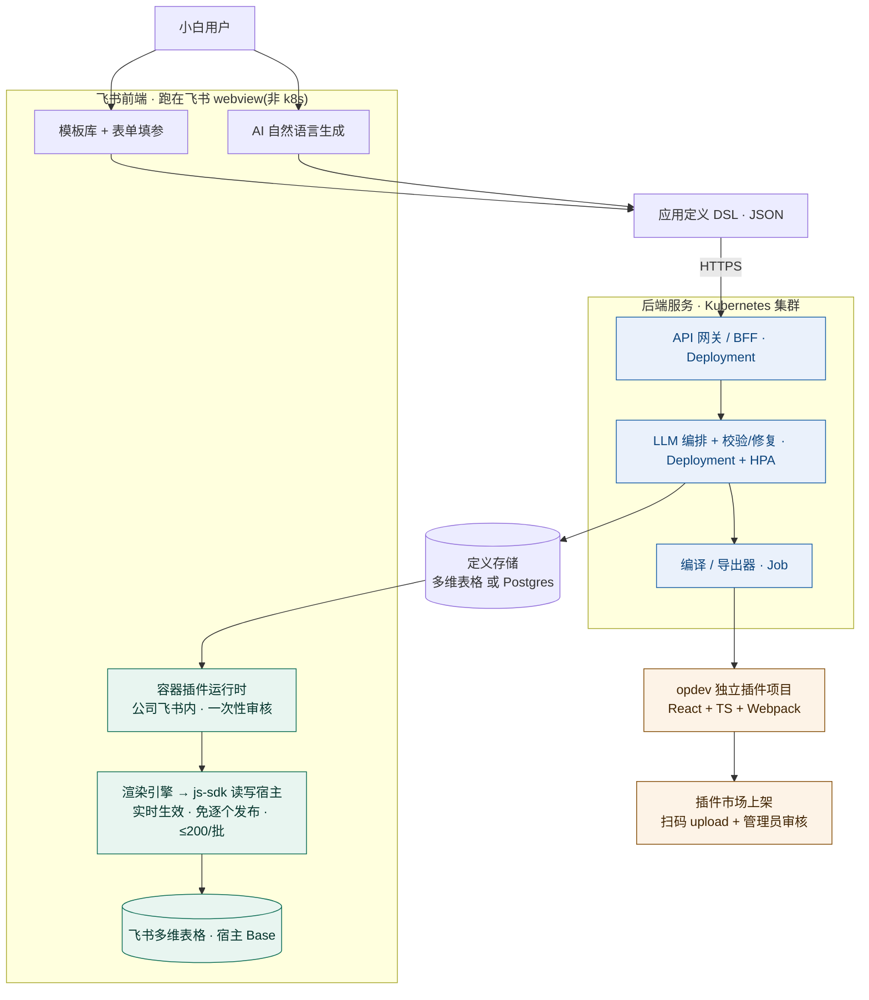
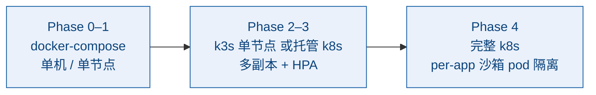

> 🌐 **中文** · [English](design.en.md)

# 飞书多维表格插件生成平台 · 技术方案

> ⚠️ **部分内容已过时(成稿 2026-06-20 的早期设计稿)**。本文保留作设计背景,但若与现状冲突,**以代码与现行文档为准**:`README.md`、`docs/PRODUCTION.md`、`docs/EXECUTE_RUNTIME.md`。已知主要偏差(下文已就地修正):**渲染器实际用 `@lark-opdev/block-bitable-api`(非 `@lark-base-open/js-sdk`)**;**主力产出是 basekit 字段捷径(addField)+ 自动化动作(addAction),容器/视图扩展是只读渲染宿主而非唯一产品**;**线上部署是 EC2 上的 docker compose + Caddy 自动 TLS(k8s 为可选的未来横向扩展路径)**;**LLM 默认 DeepSeek(可切 Claude)**;鉴权已做**能力分离**(客户端只读 token / admin 服务端 token),并已落地**审计 ledger** 与**出站(egress) ledger**。

> **一句话定位**:让小白「一键生成、一键部署」飞书多维表格(Bitable)插件的平台。
>
> **已定架构决策**:混合架构(容器为主 + 可导出) · 企业内部自用(单租户) · 模板表单 + AI 自然语言 双生成 · 后端服务 Kubernetes 部署(飞书前端容器插件不在 k8s 内)。
>
> **成稿日期**:2026-06-20 · 内容依据前置多源调研并经对抗式核查(23 条确认 / 2 条否决)。

---

## 一、核心洞察:为什么「容器模式」能让一键成立

飞书有两堵硬墙会杀死「一键部署」:

1. 自建插件发布要**企业管理员审核**;
2. `opdev login` 要**扫码授权**。

如果每个小白生成的插件都当成「新插件」去发布,就永远做不到一键。

> 💡 **破局点**:平台本身做成**一个**已审核的「容器插件」,小白生成的不是新插件,而是**应用定义(数据)**。容器拉取定义、用内置引擎实时渲染 → 生成即用、**零逐个审核**。审核只在「容器插件」首次上架时发生**一次**。这是整套架构成立的根。

---

## 二、整体架构



- **飞书前端(绿色)**:容器插件 + 渲染引擎,跑在飞书 webview,**不上 k8s**(飞书托管约束)。
- **后端 k8s(蓝色)**:API / LLM 编排 / 编译导出 容器化,k8s 编排调度。
- **导出路径(橙色)**:独立插件,需扫码 + 管理员审核。

---

## 三、生成层(模板 + AI 双轨)

| 轨道 A — 模板库 + 表单(主力) | 轨道 B — AI 自然语言(亮点) |
|---|---|
| 覆盖约 80% 需求、**零幻觉**。把高频场景做成参数化模板,小白只填表单(选哪张表、哪些字段、什么参数)。 | 覆盖长尾、体验亮点。小白一句话描述 → LLM **先尝试匹配模板并填参**,把幻觉锁死在参数层;匹配不到才生成受控 DSL 或沙箱代码片段。 |
| 场景:数据看板/统计卡、图表(柱/折/饼)、甘特图、导入导出、查找替换、去重、提醒通知、AI 字段处理(批量摘要/分类/翻译)。 | 关键约束:AI **不输出任意 React 代码**,只输出受 schema 约束的 DSL → 可校验、可沙箱、可自动修复。 |

---

## 四、应用定义 DSL(整个平台的「硬通货」)

一份声明式 JSON 同时驱动「容器渲染」和「导出编译」,这是架构能同时满足两条路径的关键:

```json
{
  "id": "app_sales_board",
  "name": "销售看板",
  "type": "view_extension",
  "bind": { "baseId": "current", "tableId": "tbl_orders" },
  "ui": {
    "layout": "dashboard",
    "components": [
      { "type": "stat",  "title": "本月销售额", "agg": "sum", "field": "金额", "filter": "month(下单时间)=THIS_MONTH" },
      { "type": "chart", "chartType": "bar", "x": "销售员", "y": { "agg": "sum", "field": "金额" } }
    ]
  },
  "actions": [
    { "id": "export", "trigger": "button", "label": "导出 Excel", "do": "exportXlsx", "scope": "currentView" }
  ]
}
```

---

## 五、容器插件 + 运行时引擎(「一键用」的载体)

> 📌 **现状校正**:实际**主力产出**是 basekit **字段捷径(addField)+ 自动化动作(addAction)**;此处的容器 / 视图扩展是**只读渲染宿主**,并非唯一产品。**不**生成飞书侧边栏插件或数据连接器。

- 一个标准的飞书**数据表视图插件**(React + TS + Webpack,官方栈),公司飞书内**发布一次**。
- 内置**通用渲染引擎**:读 DSL → 用预置组件库渲染 UI;数据访问统一走 `@lark-opdev/block-bitable-api`(运行在宿主上下文,**自动继承用户对当前 Base 的权限,无需额外授权**;写入批量 ≤ 200/次)。
- 逻辑分两档:**声明式动作**(filter / aggregate / export / notify…)覆盖绝大多数;长尾用**沙箱**(QuickJS 或 Web Worker + 能力白名单)跑 AI 生成的代码片段,防越权。

> ⚠️ **设计纪律**:引擎要「定义驱动」而非「代码驱动」——新增能力尽量靠扩 DSL/组件,而不是改容器代码。这样能把「容器重新发版审核」压到最低频。

---

## 六、后端服务(企业内部自用,可极简)

- **定义存储**:推荐直接 dogfooding —— 用**一张多维表格**存所有应用定义(owner、绑定表、定义 JSON、版本)。天然有飞书原生权限/分享,省一套数据库和后台。
- **LLM 编排**:规划 → 模板匹配 → 参数填充 → schema 校验 → **自动修复环**(校验失败回灌 LLM 重试)→ 预览。API key 放后端不暴露给前端。
- **编译/导出器**:DSL → 注入 `opdev create` 脚手架 → 打包 zip。

> 📌 **现状校正(鉴权 + 审计已落地)**:鉴权已做**能力分离**——客户端 bundle 只内嵌只读 token(读 `/api/apps*` + `POST /api/execute`),写/删/生成走服务端 admin token,泄露的客户端 token 只能读。已上线**审计 ledger**(`GET /api/audit`,管理员、追加写专表)与**出站 egress ledger**(每次外呼记录 `execute.egress`、SSRF/重定向拦截记 error,优雅排空)。详见 `docs/PRODUCTION.md` / `docs/EXECUTE_RUNTIME.md`。

### 6.1 Kubernetes 部署(后端服务上 k8s)

> 注:**只有后端服务上 k8s**;飞书容器插件是前端、跑在飞书 webview,不在 k8s 内(见第二节架构图)。

| 服务 | k8s 工作负载 | 说明 |
|---|---|---|
| API 网关 / BFF | `Deployment` + `Service` + `Ingress` | 容器插件与生成端 UI 的统一入口;TLS 终止在 Ingress。 |
| LLM 编排服务 | `Deployment` + `HPA` | 无状态、突发型负载;按 QPS / 并发自动扩缩。 |
| 编译 / 导出器 | `Job`(按需) | DSL → opdev 项目打包是一次性构建任务,用 Job 起 build pod,完成即回收。 |
| 定义存储 | 外部(多维表格)或 `StatefulSet`(Postgres) | 用多维表格则不在集群内;要强一致 / 复杂查询再上 Postgres。 |

- **配置与密钥**:LLM API key、飞书自建应用 `app_id/app_secret` 用 `Secret`;模型选型、限流参数用 `ConfigMap`。
- **环境隔离**:`namespace` 分 dev / prod;镜像走 CI 构建 + 私有 registry。
- **可观测**:统一日志 / 指标;LLM 调用计费与失败率单独打点(余额耗尽要能第一时间发现,别被误判成别的故障)。

> ⚠️ **right-sizing 提醒**:企业内部自用、单租户的体量,完整 k8s 可能偏重。若并发不大,`k3s` 单节点 / `docker-compose` 就够;迁完整 k8s 的真正收益在**后续 per-app 沙箱 pod 隔离(Phase 4)**和多副本弹性。建议先把后端容器化 + k8s 编排做扎实,沙箱隔离 Phase 4 自然落到同一集群。

---

## 七、部署故事(诚实拆解「一键部署」的边界)

| 路径 | 能否真一键 | 说明 |
|---|---|---|
| **容器路径(默认)** | ✅ 真一键 | 小白点「发布」= 后端存一条定义记录,容器即时渲染。零审核、即时生效。 |
| 容器插件本身 | 一次性 | 首次上架需管理员审核一次;平台升级容器时偶尔重发(低频)。 |
| **导出路径(高级)** | ⚠️ 半自动 | 受 `opdev login` 扫码 + 管理员审核约束;平台做到「一键生成项目 + 一键 build + 引导发布」,最后一步人工。 |

---

## 八、MVP 分阶段路线图

| 阶段 | 交付物 | 说明 |
|---|---|---|
| **Phase 0** 地基(1–2 周) | 容器插件骨架 + 渲染引擎(1–2 种组件)+ 定义存储(用多维表格) | 在公司飞书发布一次,跑通「存定义 → 容器渲染」闭环。 |
| **Phase 1** 模板轨道 | 5–8 个高频模板 + 表单生成器 + 实时预览 | **此时已对小白可用。** |
| **Phase 2** AI 轨道 | 自然语言 → 模板填参 + schema 校验/自动修复 | 体验亮点,建立在 DSL 地基上。 |
| **Phase 3** 导出 | DSL → opdev 项目 zip + 发布引导 | 半自动,解决「真插件」诉求。 |
| **Phase 4** 长尾 | 沙箱执行 AI 代码片段 | 覆盖模板覆盖不到的场景。 |

### 8.1 部署演进:先 compose、后 k8s

后端架构按 k8s 设计,但**不必一开始就上完整 k8s**。按阶段和并发压力渐进迁移:



| 阶段 | 部署形态 | 迁移触发信号 |
|---|---|---|
| Phase 0–1 | `docker-compose`(后端几个服务一把起)/ 单节点 | 验证价值期,并发小,运维越简单越好。 |
| Phase 2–3 | `k3s` 单节点 或 托管 k8s;LLM 编排上多副本 + HPA | 用户 / 并发上来,需要弹性、滚动发布、Secret 规范化。 |
| Phase 4 | 完整 k8s;每应用 / 每租户一个沙箱 `pod`(资源配额 + 网络策略) | 上线 AI 代码沙箱,需强隔离防越权 + 资源限额。 |

> 🏁 **关键**:镜像和 manifest 从 Phase 0 就按「可被 k8s 编排」来写(12-factor、无状态、配置走环境变量 / `Secret`),这样 compose → k8s 是平滑切换,不是重写。

---

## 九、技术栈选型(贴合现有能力)

- 容器/前端:React + TS + Webpack + `@lark-opdev/block-bitable-api`。
- 后端:**Go**(已有大量飞书 Go 项目积累)做 LLM 代理 + 编译导出;存储用多维表格(也可叠 Postgres)。
- LLM:**默认 DeepSeek**(可切 Claude;规划 + 受控生成,强约束 JSON 输出)。
- 沙箱:`quickjs-emscripten` 或 Web Worker + 能力白名单(Phase 4 服务端隔离时可迁为每应用一 k8s pod)。
- **部署(现状)**:线上是 **EC2 上的单节点 docker compose + Caddy 自动 TLS**(Let's Encrypt,经 `<ip>.sslip.io` 魔法 DNS;`STORE=bitable`);**k8s 为可选的未来横向扩展路径,非主路**。Docker 镜像 + `Secret` / `ConfigMap` 仍适用;单租型不必上完整 k8s。
- 可直接复用已装的 `lark-cli` / lark-* skills 做表格读写与发布运维。

---

## 十、关键风险与差异化(必须想清楚)

> ❗ **正面撞官方「应用模式」**:飞书 2025-11 已上线零代码搭建 + AI 生成工作流 + 数百 AI 捷径。差异化必须是其中之一:更垂直的行业模板、**可导出为独立插件**(官方不给)、私有/自托管可控、深度接已有 Go + lark-cli 工具链做自动化。

1. **AI 幻觉** → 模板兜底 + schema 校验 + 自动修复 + 预览确认,绝不让 AI 裸生代码直接上线。
2. **沙箱安全** → AI 代码在容器内跑,严格能力白名单防越权读写宿主数据。
3. **js-sdk 能力边界**(批量 200、API 范围)→ 复杂逻辑降级到声明式动作,或走自动化插件(`@lark-opdev/block-basekit-server-api` 服务端轨道)。
4. **容器发版审核频率** → 靠「定义驱动」压低;每次容器重发都要管理员审核,是体验的隐性成本。

---

## 十一、下一步

**最务实的起点**:先做 Phase 0 + Phase 1(容器 + 渲染引擎 + 模板轨道),不碰 AI、不碰导出,2–3 周让小白用起来、验证价值。AI 和导出都是这套 DSL 地基上的增量。

- [ ] 起 Phase 0 脚手架:opdev 容器插件骨架 + 最小渲染引擎(读 DSL 渲染一张 stat 卡)
- [ ] 细化 DSL schema 全量定义(所有组件/动作/数据绑定字段规范)
- [ ] 补竞品缺口调研:vika / 腾讯智能表格 / 钉钉多维表的插件体系对比

---

## 附:调研依据与关键引用

以下事实经多源一级文档 + npm registry 独立核验、并经 3 票对抗式核查确认(置信度高):

- 插件分三类:记录视图 / 数据表视图 / 自动化;架构归为「模型&数据 / 视图 / 逻辑」。
- 统一工具链 CLI `@lark-opdev/cli`(opdev);视图类官方栈 React + TS + Webpack。
- 视图 SDK `@lark-base-open/js-sdk`(批量写 ≤ 200)/ `@lark-opdev/block-bitable-api`;自动化 SDK `@lark-opdev/block-basekit-server-api`。
- 发布链路:upload 语义化版本 → 配置元数据 → 创建版本 → 申请线上发布 → 企业管理员审核。
- 正面竞品:飞书官方「应用模式」于 2025-11-20 上线(零代码搭建 + AI 生成工作流 + 数百 AI 捷径)。

参考来源:

- [飞书多维表格扩展能力总览(官方)](https://open.feishu.cn/document/base-extensions/base-extension-introduction?lang=zh-CN)
- [数据表视图扩展开发指南(官方)](https://open.feishu.cn/document/base-extensions/base-table-view-extension-development-guide?lang=zh-CN)
- [自动化扩展开发指南(官方)](https://open.feishu.cn/document/base-extensions/base-automation-extension-development-guide?lang=zh-CN)
- [Base JS SDK 文档](https://lark-base-team.github.io/js-sdk-docs/zh/api/table)
- [飞书官方「应用模式」介绍](https://www.feishu.cn/content/article/7578812241772924111)
